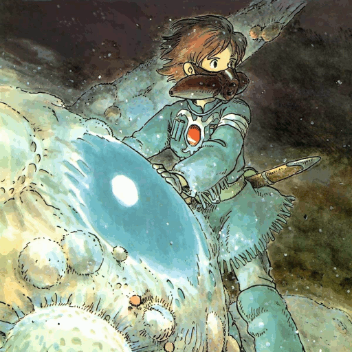

# Inefficient picture rotation algorithm

Author: Daniel Jonsson  
License: [MIT License](LICENSE)

Only works with nightly version of Rust.

## Description

This program illustrates two variants of the same inefficient rotation
algorithm:

1. The first splits the picture in four parts, moves them one step clockwise
   and recursively does the same to each part, down to the pixel level.

2. The second splits the picture in four parts, calls the same function on each
   part recursively. When it is down on a 2x2 block level it rotates them
   clockwise, and then it keeps doing that upwards in the call chain.

## Example

Two GIF compilations of the original picture, followed by 9 pictures that each
is gradually more rotated using the program's algorithms.

Created the GIF images with GIMP.

### Algorithm 1

### Algorithm 2

## Instructions

1. Put a 512x512 pixels large 24-bit BMP image in the project's root directory
   named `img1.bmp`.
2. Execute `$ cargo run`.
3. Done. In the project's root directory you can now find a sequence of 10
   images which are gradually rotated using a recursive algorithm.

Run the alternative algorithm by changing in [src/main.rs](src/main.rs):

    let alt_algorithm = false;

to:

    let alt_algorithm = true;

## Room for improvement

* Support more sizes than 512x512.
* Make main loop more efficient (i.e. don't redo work for each iteration).
* Compatibility with stable Rust.

